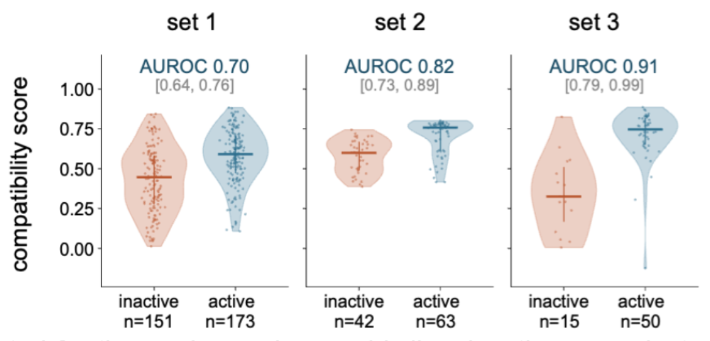

# NeurALPS

NeurALPS estimates how well domains and their connections fit within a nonribosomal peptide synthetase (NRPS) assembly line.

[Try the model in Colab](https://colab.research.google.com/github/AMIRMOHAMMAD-OSS/NeurALPS-v2/blob/main/NeurALPS.ipynb)

## Model

NeurALPS combines ESM-C protein embeddings with a contextual encoder trained to reconstruct masked parts of natural NRPS assemblies. It scores compatibility using nearby parts (local) or the wider assembly (global). A separate supervised head estimates whole-assembly activity.

## Results

The figure below shows compatibility predictions on three engineered NRPS sets without fine-tuning. Active constructs generally receive higher scores.

- **Set 1:** 324 NRPS constructs combining 6 initiation, 9 elongation and 6 termination XUTs ([study](https://paperpile.com/c/pq8nRc/Di5g)).
- **Set 2:** 105 single-exchange, three-XUT constructs based on the chaiyaphumine-producing assembly line ([study](https://paperpile.com/c/pq8nRc/5FsL)).
- **Set 3:** 65 constructs with generated T domains in a minimal GxpS assembly line ([study](https://paperpile.com/c/pq8nRc/0gY2)).

Each point is one construct. Bars show the median and interquartile range. AUROC measures how well scores separate active and inactive constructs; the brackets show 95% bootstrap intervals over constructs.

Active means the expected peptide was experimentally detected. Inactive means no product, or no expected product, was detected.
