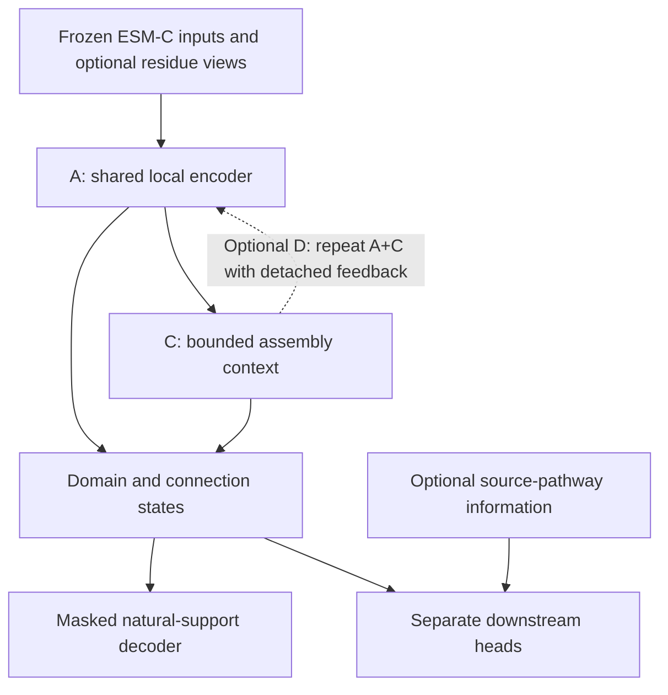

# NeurALPS Phase 2: foundation encoder and execution specification

**Version:** phase2.2, 14 September 2026. Research specification for the NeurALPS v2 repository; supersedes the phase2.1 design.

**Research objective:** adapt frozen ESM-C to natural NRPS assembly organization, produce reusable domain and connection representations, and demonstrate their value through downstream engineering tasks. The primary programme is A plus C. D is a conditional refinement experiment. Final here means the execution specification is fixed for the next experiments; it does not mean the architecture has been empirically established as optimal.

**Deliverables:** this design, the separate full execution plan, machine-readable configuration and experiment registry, and the reference implementation in `src/neuralps_v2/`. Current-corpus adapters, residue extraction, source-pathway integration and full production training are explicitly scheduled work. The verification record states which local checks actually ran.

## 1. Decisions and hypotheses

| Topic | Adopted decision | Empirical question |
|---|---|---|
| Scientific scope | Domain-specific foundation encoder built on ESM-C | Does natural NRPS adaptation improve transfer beyond generic PLM features? |
| A | Shared domain/connection input encoder and four local context blocks | Do local context and direct B features improve transfer? |
| C | Complete A plus bounded assembly read/write context | Does assembly context improve on A under matched inputs, labels and compute? |
| D | Two shared-weight C passes with detached recycle adapters | Does refinement add value beyond extra training or depth? |
| Residue information | Pretrained residue states are the preferred next input experiment; pooled cache is the first control | Is retaining residue detail useful for engineered variants? |
| Natural objective | Leakage-safe masked embedding prediction; low-weight candidate ranking; separately tested residue-span objective | Which task learns transferable information instead of primarily family identity? |
| Activity head | Same pooled nonlinear head across A/C/D in the primary comparison | Does the encoder help with a fixed head? |
| Interpretability head | Separate additive head with explicit local factors | Can a useful prediction be decomposed into stable model contributions? |
| Source context | Separate, optional provenance-enriched input track | Does donor-source pathway information add value beyond the engineered sequence? |
| Downstream uses | Bode construct activity and T-domain quantitative activity | Does one natural encoder support more than one engineering task? |

The model without NRPS SSL is a required comparator within a foundation-model project. Failure to improve one downstream task is a result to report; it does not automatically invalidate every representation use. Conversely, better SSL loss or a visually convincing map alone is insufficient evidence of useful transfer.

The natural corpus supports representation learning. The small, correlated engineered datasets constrain how much supervised adaptation and model selection can be justified. Do not derive the permissible foundation-encoder size solely from the 324 Bode-1 labels, and do not count every natural connection as an independent activity observation.

## 2. Evidence ledger and its implications

### 2.1 Current project data

The project data audit dated 12 September 2026 is authoritative for the current substrate. The repository preserves that reported audit; packaging has not independently re-extracted the corpus.

| Inventory | Accepted current value | Scope |
|---|---|---|
| Natural assembly lines upstream | 159,130 | Context; not all are permitted training examples |
| Route-A core | 42,415 lines | 33,932 train, 4,242 dev, 4,241 internal test |
| Natural unique connection windows | 943,506 | Cache inventory; load only occurrences allowed by the training split |
| Bode-1 | 324 constructs; 173 active, 151 inactive | Supervised development; 21 donor parts; 194 unique connection windows |
| Bode-2 | 106 constructs; 64 active, 42 inactive | Retrospective external evaluation; 307 unique connection windows reported |
| Bode-2 occurrences | 1,854 D; 1,324 B; 424 J | 347 same-chain J, 77 physical breaks; 530 module annotations |
| Cross-library donor overlap | Zero reported between Bode-1 and Bode-2 | Part-disjointness does not prove absence of sequence homology or assay shift |
| Embeddings | ESM-C-600M, 1152-dimensional, float32, AA-token mean | CLS/EOS/PAD excluded; reported domain-reference cosine gate 0.99994 |

The Bode-2 role listing 258 B + 33 J + 16 terminal entries + 1 TE sums to 308 role entries. Reconcile role membership with the 307 unique-key union at the adapter boundary; do not silently change either audited count. TE remains a domain regardless of where its cache record is stored. Sequence-vector agreement does not prove residue resolution or full-parent extraction context.

### 2.2 iGEM manuscript: a required biological baseline

The supplied `Manuscript_iGEM_v14.pdf`, pages 8-10 and Figure 4, studies 105 single exchanges. Above 50% donor-source TE similarity to the recipient TE, 43 of 51 constructs were active; below 50%, 20 of 54 were active. The selected group's success rate is 84.3%. Calling the high group active and the low group inactive gives TP=43, FP=8, FN=20, TN=34, accuracy 73.3%, sensitivity 68.3%, specificity 81.0%, and balanced accuracy 74.6%. These are descriptive calculations on that cohort, not a new external test. Continuous TE-score AUROC cannot be recovered from the two bin counts.

The paper reports active exchanges at XUT2=14/35, XUT3=19/35 and XUT4=30/35. Thirty-one of 35 donors work somewhere. It also reports 25/33 productive double exchanges and 15/27 productive triple exchanges under their respective selection procedures. Those are distinct cohorts, not extra independent observations of the same test. Page 14 states that the TE threshold derives from one NRPS family and needs broader validation.

The TE comparison uses the donor's original biosynthetic pathway. Its TE need not appear in the inserted sequence. Merely retaining the engineered construct's terminal TE cannot necessarily reproduce this feature. Source-pathway sequence information is therefore a legitimate optional input with a separately reported availability contract. Source IDs themselves are not neural features.

Interpretation: evolutionary relatedness contains useful biological information. It is neither automatically leakage nor sufficient evidence of causal interface compatibility. Matched comparisons must establish whether NeurALPS adds information beyond TE relatedness, position and substrate/class covariates. Never dismiss this baseline by comparing its precision to a different model's AUROC.

The 106-record Bode-2 cache and paper's 105 single-exchange cohort need an explicit ID map. An additional active control would explain the arithmetic, but its identity must come from the manifest. Preserve the whole accepted dataset and record the paper-matched subset separately.

### 2.3 T-domain preprint: a second downstream task

The supplied `872ac636d872e867d13d6b56.pdf` is the supplementary information for Buelbuel et al., *Generative AI designs functional thiolation domains for reprogramming non-ribosomal peptide synthetases*. Pages 24-27 specify an 85-sequence benchmark with 55 train and 30 test sequences; the reported nearest train/test distance is at least 25 mutations. Table S4 reports Spearman correlation with quantitative production:

| Method | Mean Spearman | Reported 95% bootstrap interval |
|---|---|---|
| Mean-pooled ESM-C plus random forest | 0.25 | -0.10 to 0.59 |
| Unrolled residue embeddings plus linear head | 0.57 | 0.26 to 0.83 |
| Masked marginal score | 0.35 | -0.05 to 0.74 |
| MSE fine-tuning | 0.38 | 0.00 to 0.72 |
| Contrastive fine-tuning | 0.43 | 0.11 to 0.73 |

These wide, overlapping intervals do not establish a significant ordering. The comparison also changes heads when it changes pooling; it is not a clean proof that pooling alone causes the difference. It motivates a matched residue-information ablation. Their contrastive fine-tuning uses supervised fitness ordering, a Bradley-Terry objective, KL regularization to the original PLM and LoRA. It is different from natural-adjacency InfoNCE.

Read-only inspection of `0762b9babfa0930a4ffb08e9.xlsx`, sheet `Aminoacid_Sequence_FLL_Titer`, found 249 sequence rows with numeric production including the WT control, plus ten sequence rows without numeric flL production. Some numeric rows contain shorter sequences. Preserve their actual strings and possible truncation biology; do not pad them into invented WT sequence. This is an inventory observation, not a reconstruction of the authors' 85-sequence split. The 578 experimental variants reported in the main preprint are not 578 independent rows in this sheet.

The new task is quantitative production in a defined scaffold/assay. Keep zero, missing and not-tested states distinct. Recover author split IDs before claiming to reproduce Table S4. A new group/parent-distance split is useful but must be named as a new evaluation.

### 2.4 Prior NeurALPS and general-method evidence

Prior project evaluations report approximately 0.69 within-Bode-1 donor-held-out performance for frozen ESM-C plus a nonlinear head and approximately 0.64 +/- 0.08 Bode-1 to Bode-2 transfer. Preserve these as prior reported results, not measurements made by this package. Old natural-adjacency InfoNCE did not add transferable benefit. Old J inputs were severely weaker than the domain representation. Both facts justify corrected controls before attributing gains to new pretraining.

The supplied legacy `routea_v2d.py` was previously found to pass `assembly_module_count - 1` as a transition offset at four call sites. Check the exact production index contract; CSR starts are distinct from counts. Previously reported evaluator problems include averaging actual/dummy candidate columns and clipping finite logits. Repair actual-candidate selection and score validity before comparison. Historical reports and filenames are not proof that current production bytes have these fixes.

Reim et al. study approximately 0.65 accuracy on a PPI benchmark, not an NRPS AUROC ceiling. Pool PaRTI and optimal-transport pooling motivate inspecting residue information; they do not establish optimal k=20 or recover residue states from a pooled vector. The recent ProteinJEPA preprint motivates testing masked-position embedding and token objectives together, but differs from our detached fixed teacher. These external precedents motivate experiments, not guaranteed gains.

## 3. Biological objects, windowing and provenance

D is one resolved catalytic/carrier domain, preserving C subtypes, AMP-binding as A, PCP as T, E and TE. Exclude redundant TIGR01720, TIGR01733 and AMP-binding_C overlays according to the accepted vocabulary. Unknown supported-domain labels need a documented mapping; do not silently filter domains from complete routes. Upstream PKS counts do not establish a PKS foundation model: the initial claim is restricted to the selected Route-A corpus and vocabulary.

The graph is an ordered route of alternating domains and connections. There is no module token or module-relative position. B and same-chain J are both COVALENT in neural computation; the B/J annotation is retained for display and stratified results. A physical inter-protein continuation is BREAK. Module relabeling must leave features, masks, context and predictions invariant.

Three sequence slots per graph object are used in the reference:

| Object | Slot 0 | Slot 1 | Slot 2 |
|---|---|---|---|
| D | Domain vector | NA | NA |
| Covalent connection | Window vector | NA | NA |
| Precursor break | NA | Upstream C terminus | Downstream N terminus |

Each covalent connection uses the audited `[20 left residues][gap][20 right residues]` recipe. A zero-length gap with nonempty flanks is not an empty sequence. Preserve the audited cap/crop policy at 512 aa. A gap longer than 472 aa cannot retain both 20-aa ends inside one contiguous 512-aa window; preserve retained intervals and coverage flags. Do not concatenate remote fragments into a fictitious contiguous peptide. Version a multi-view policy if needed, uniformly across datasets.

Intein precursor termini remain separate translations. A validated mature splice product can be an additional view later; preserve precursor provenance, splice coordinates and uncertainty. A persistent docking interface and a splicing precursor are not the same mechanism. No natural docking score is claimed to estimate intein efficiency. Do not infer a through-translation across separate ORFs.

Engineered changes can be inside D. Retain the actual complete domain sequence and provide residue views inside domains, initially whole T domains and consistently defined views for other domains. Scar annotations describe edit coordinates; they are not labels that the scar caused failure. The iGEM manuscript's scar-control results are useful controls specific to those tested constructs, not universal innocuous-scar labels.

### 3.1 Feature identity versus sequence identity

Keep two keys. `hash` is the SHA-256 of the owned object sequence and is used to detect exact sequence copies. `feature_key` identifies the embedding computation: model/weights, tokenizer, input-sequence hash, retained/pooling coordinates, extraction recipe and relevant context. Identical local windows embedded in different parent inputs cannot automatically share one feature key. If extraction actually used the same standalone window, deduplication by that identical recipe is appropriate.

The existing cache remains reusable. Export its exact identities and dependencies rather than rerunning extraction without need. If context identity was not recorded, investigate that field before masked SSL; clean supervised use and masked-learning eligibility are distinct questions.

`owned` spans describe the residues selected as the target object. `dependencies` spans describe every translated residue seen by the clean PLM input generating a feature. Exact-copy aliases map corresponding residue intervals across views and occurrences. Hiding a feature does not make all its dependencies new targets. Conversely, every feature whose input saw a forbidden target residue must be hidden or recomputed.

### 3.2 Canonical tensors

`Batch.x` is [B,T,3,1152]; `state` is [B,T,3]; `kind`, `domain_type`, `pos`, `chain`, `valid` are [B,T]; `meta` is [B,T,6]. Use state NA/OBSERVED/EMPTY/MISSING/MASKED and separate graph padding. Missing vectors are never biological zeros. `pos` is physical route order, and BREAK has chain=-1. Chain IDs convey equality, not memorized protein identity.

The six metadata channels are log1p intended sequence length, retained/intended length fraction, empty-core indicator, missing-required-slot indicator, coordinate-uncertainty indicator and route-confidence score. Exporters must define each value identically across datasets, mask all sequence-derived metadata dependencies, and provide metadata-only controls. Unavailable route confidence is not an invented confidence of one; use the documented missing convention and report its prevalence. A metadata-ablated primary sensitivity run sets all six channels to zero.

Teacher vectors, teacher means, primary target masks, assay labels, donors and source-context records live outside Batch. `manifest_adapter.py` validates structure and prepares pooled masked tensors. It cannot establish biological provenance from column names and does not implement current-corpus exports or raw/residue feature extraction.

## 4. Foundation encoder A

The production candidate begins with the explicit reference dimensions: width 256, 8 heads, four local blocks, FFN width 1024, dropout 0.1, attention radius +/-6 interleaved positions per block. These preserve the supplied reference and permit matched A/C/D comparisons. A width-128/two-block local model is a budget/capacity comparator requiring its own parameterized implementation, not a silent setting in this reference.

Each observed sequence slot passes through LayerNorm1152 -> Linear1152,256 -> LayerNorm256. Add slot and state embeddings; NA slots contribute zero. Fuse three ordered slots with Linear768,256 -> GELU -> Linear256,256. D uses its projected first slot plus canonical domain-type embedding. Add physical-kind embedding and masked metadata projection. Normalize and zero padding.

Local attention has signed relative-position bias, clipped to +/-32, and physical relation bias for same chain, distinct chains and a relation involving a break. No module mask is used. Reapply validity after every block. Padding queries get a safe attention row so softmax never sees an all-invalid row. The reference uses dense attention with a local mask; its memory is still quadratic in graph length. A sparse implementation is an optimization that must match the dense oracle.

Four radius-6 blocks provide a broader potential receptive field than one domain/edge triplet. This matters because masking an overlapping connection can remove both endpoint domain features. It does not prove the surviving information is useful; record survival by target type.

### 4.1 Residue-aware endpoint and raw-AA comparison

The first run is A_pool using completed vectors. The preferred next variant is A_residue: obtain real frozen ESM-C residue vectors, project each 1152-vector to 128, learn an attention score per residue, pool left/core/right regions separately, concatenate three 128-vectors and three presence flags, then project 387 -> 256. Inject the result at its sequence slot through `0.5 * sigmoid(gate)`, gate initialized to -2. The reference argument `raw_features` is a legacy name for these online pooled residue features; it does not change their provenance.

`pretrained_residue.py` supplies the trainable pooling component. It does not extract residue states. Frozen per-residue tensors may be stored only when their generating view satisfies the intended task; a clean contextual tensor cannot be made leakage-safe merely by zeroing the masked positions after extraction.

For ordinary domain slots, use the domain as core. Short T domains can retain all positions. For connection views use the audited left/core/right coordinates. Encode the two break termini independently. For longer D objects, specify a consistent contiguous tiled extraction policy and ownership merge; do not call a single truncated vector full residue coverage. Shared representations and masks must not privilege Bode-only edit locations.

A_raw remains the lower-storage comparator: 28-by-32 AA embedding, 3-by-32 region embedding, projection to 128, four two-convolution residual blocks at dilations 1/2/4/8, kernel 5, and the same regional pooling. Recompute the CNN after raw masking. Its 121-residue receptive field is a design choice; it is not a substitute for pretrained residue states.

Run residue detail on a deduplicated pilot first. At 512 residues, 1152 features and two bytes per value, 943,506 windows would require roughly 1.11 TB before indexing, domain states or multiple contexts. Actual storage must be calculated from retained lengths and permitted training keys. This upper-bound calculation argues for streaming, selective caching and pilot measurement, not abandoning residue information. Existing pooled float32 caches remain unchanged.

## 5. Assembly context C and conditional refinement D

C contains A's complete local computation, then two global exchange blocks with four learned 256-dimensional assembly slots. Slots attend to all valid objects, update through FFNs, and write back to every domain/connection. Bound the write-back multiplier by 0.5 * sigmoid(gate). Zero the outward projection and final token-side FFN layer so copied A and initial C have identical evaluation-mode outputs. Slot count and depth are capacity settings, not biological constants.

The goal is to represent downstream context, terminal processing and distant constraints. C does not receive donor IDs, labels, module tokens or a separate scalar natural energy. The iGEM position effect motivates testing this capacity; an optional biochemical-state feature experiment must remain uncertainty-aware and separately evaluated.

Use `copy_variant` to transfer the complete compatible bundle, including the masked decoder and an attached residue pool. An encoder-only copy would silently reset the learned natural scoring head. C warm-up trains the new context and decoder, followed by controlled joint adaptation. Compare with A receiving the same additional optimization and a compute/depth comparator before assigning gains to global context.

D uses two passes through complete C, with shared weights. Pass one begins from the input projection and original slots. Pass two begins from those same anchors plus small adapters of detached previous token and slot states. Adapters use LayerNorm -> Linear256,64 -> GELU -> Linear64,256; zero the final layer and initialize the bounded gate to -2. Do not use a clean view on pass two. Train both passes with 0.25 and 0.75 weights for every enabled objective, including activity. Deploy the last pass. Third-pass inference is diagnostic only; bounded gates do not prove convergence.

D is scheduled only after C is stable and an explicit hypothesis/compute comparison is registered. If D adds no reproducible benefit, release A/C without treating the foundation programme as incomplete.

## 6. Optional source-pathway context

The primary construct-only track uses only the engineered assembly sequence and label-independent annotations. The provenance-enriched track additionally uses source sequences available at design time. It is not a dataset-name or donor-ID embedding.

Start with a scalar TE alignment baseline and recipient-relative physical position. Version the aligner, coverage filtering, identity/similarity definition and denominator; recover the manuscript's actual calculation before claiming exact reproduction. Include a baseline combining TE, position and C class with regularization fitted on development data only. If source TE is absent or ambiguous, preserve missingness and cohort coverage; do not replace it with recipient TE.

The next source-context model encodes the donor's natural pathway using the same selected natural encoder, then conditions the affected object on source and target context. A minimal pilot uses independently projected donor-source TE, recipient TE and their interaction plus measured alignment score through a small residual adapter. Full source-route summaries follow only if this pilot helps. This source adapter is specified, not implemented in the supplied reference. Do not silently supply source features to the pooled-only factory.

During natural masked SSL, an unmasked copy of the target in its source pathway would leak it. Apply the same ownership/dependency and alias closure to every source view, or restrict the source adapter to clean downstream adaptation. The initial production plan uses the latter. Natural pretraining remains source-input-free; source context is a separate downstream experiment.

Compare construct-only ESM-C versus construct-only NeurALPS, and provenance-enriched ESM-C versus provenance-enriched NeurALPS. Report both; otherwise an input-information difference can be mistaken for a pretraining benefit. Novel de novo components without a natural donor remain supported by the construct-only path.

## 7. Natural self-supervision and masking contract

Sample only permitted natural training assemblies. Draw about 10% primary object targets initially, balance D/covalent/break categories when present and avoid nearby targets where practical. This is a starting policy, not a promise of the final fraction hidden. Build the forbidden set from target-owned residue spans, exact sequence copies and residue aliases. Remove every clean feature whose generating input intersects that set. Corrupt all corresponding raw views and recompute them. Mask metadata carrying forbidden sequence information. Preserve topology and known domain type as conditioning information; do not claim to predict annotations supplied as input.

Do not expand the forbidden residue set merely because a collateral feature was removed. Collateral masked slots are not automatically reconstruction targets. For break-pair targets average the two terminal losses at the relation level, rather than doubling that relation's weight. There is no recursive access to clean source copies or a clean second D pass.

For each target, log the number of independent sequence-bearing objects surviving within A's effective neighborhood and the full closure fraction. Initially require at least two surviving objects or an equivalently documented amount of unmasked raw context. A's eligibility set must be used when comparing A with C, so C does not win by receiving easier/more training data. Record excluded assemblies/targets and reasons. Monitor 25-45% closure as an initial diagnostic range, not a requirement to falsify provenance.

If full-parent extraction makes local masked targets mostly ineligible, the valid next steps are online extraction of genuinely corrupted parent inputs, a separately versioned local-context extraction recipe, or limiting the first SSL task to eligible views. A completed clean cache can still be unsuitable for a proposed masked task. Never retain contaminated vectors to make the mask ratio look reasonable.

### 7.1 Object embedding prediction

The detached teacher is the clean ESM-C object/terminal vector. The shared decoder takes the 256-dimensional object state plus 16-dimensional slot and kind embeddings: LayerNorm288 -> Linear288,512 -> GELU -> Linear512,1152. It never takes the clean target as a student input.

The primary loss is `L_object_slot = 1 - cosine(prediction, teacher)` in float32, epsilon 1e-6. A predefined centered-target comparison is `0.25 * raw_cosine_loss + 0.75 * cosine_loss(prediction - mean, teacher - mean)`. Means use permitted natural-training features only: D subtype, ordered endpoint types for covalent windows, terminal orientation for breaks. Require at least 100 unique features for a specific group or fall back to the broad role. Store mean identities. If a target's residual norm is below epsilon, use raw loss. In the raw-cosine recipe supply zero mean tensors; the public API keeps one shape contract.

Average slots within each primary relation, relations within each present physical category, categories within each assembly, then assemblies. Do not train the teacher or learn the centering statistics from natural dev/test or engineered libraries. Log category-specific losses and a type-conditioned mean-prediction baseline to detect trivial family reconstruction.

### 7.2 Candidate-ranking auxiliary

For a masked query and candidate teacher vector, natural support is `S_N = 1 - selected_object_loss`. Average equally available terminal slots for a break. With a candidate panel of 32 initially, apply a multi-positive log-softmax loss at temperature 0.07 and weight 0.05, ramped over the first 10% of updates. The rank-zero comparator uses the identical object objective and training schedule.

Candidates come only from the allowed training pool, with the same physical role/endpoint-type constraints. Dedupe exact sequence positives and mark known equivalent positives. Invalid candidates are excluded before logsumexp; never average dummy columns or clip finite logits. A training query needs a positive and an unobserved alternative. An alternative is not experimentally inactive. This objective models conditional natural support.

Gather query predictions from the same current forward pass. `training_objectives.current_rank_loss` accepts query row, token and slot indices and rejects external precomputed query predictions. Group losses by relation/kind/assembly. D uses both passes with the same configured pass weights. Save candidate sampler and reference-panel identities with checkpoints.

### 7.3 Residue-span objective

Span prediction uses a separate corrupted view from whole-object masking. Start at 15% selected residues with geometric mean span length 3 and cap 10. MASK selected residues, propagate corruption across all copied views and clean pooled dependencies, and rerun every affected sequence/residue encoder. Balance core/flank targets; count each physical residue once per objective view. PAD/MASK/UNK are not prediction labels.

Use the 128-dimensional residue state with a 256-dimensional contextual object state. The supplied SpanDecoder generates gamma/beta from context, computes `(1 + 0.1*tanh(gamma))*residue + beta`, normalizes and predicts 25 AA/ambiguity classes. The classifier label is original AA token ID minus 3. Keep raw and ESM-residue student views separate experiments; a span target cannot use a clean cached PLM feature that saw its identity.

The intended combined objective is `L = L_object + lambda_rank * L_rank + lambda_span * L_span`, with span weight ramped to 0.2 over the first 20% of residue-stage updates. Run object-only versus object-plus-span as a controlled objective comparison. `ssl_step` accepts a callback for the independently recomputed span view; data collation, corruption and normalization for that callback remain production work. A detached or stale scalar is not a valid span-training implementation.

### 7.4 Diagnostic requirements

Track primary counts, closure fraction, surviving context, D/covalent/break losses, type-mean baseline, candidate discrimination, embedding variance, gradient norms and train/dev nearest-family distributions. Perturb a true neighboring sequence while holding topology fixed and verify that the contextual prediction can change. Replacing masked inputs by arbitrary values must not change outputs. Low natural loss alone never promotes a model as a useful engineering predictor.

## 8. Downstream heads and interpretable outputs

The primary Bode head reads `[mean D states, mean connection states, max connection states, log1p D count, log1p connection count]`, 770 features for width 256. It is LayerNorm770 -> Linear770,128 -> GELU -> Dropout0.3 -> Linear128,1. Use one unweighted BCE-with-logits term per construct. No artificial construct labels are derived from natural alternative candidates.

Compare three adaptation modes in order: frozen natural encoder/head-only probe, restricted unfreezing, then broad unfreezing only if the earlier modes justify it under inner validation. Restricted A opens the last two local blocks; restricted C opens global blocks; restricted D opens global blocks and recycle adapters. Freeze the generic ESM-C backbone throughout this initial programme. Frozen encoder subtrees use evaluation mode during probes so dropout does not silently change cached features.

### 8.1 Explicit activity contributions

`interpretability_head.py` supplies an optional additive head. It computes shared domain factors from h_i, and shared connection factors from the ordered triple of left D, contextual E and right D states. Mean-normalize domain and connection contributions separately and add a linear function of the two log counts. The components sum exactly to this model's logit.

This is a separate head comparison, crossed with the same candidate encoders. It cannot replace the fixed-head transfer comparison after results are inspected. Contextual h states overlap in their evidence; multiple factors can respond to one physical edit. Reference-centering improves display comparability but does not identify a unique biological allocation of effects under correlated donor reuse. The report never calls these factors calibrated seam probabilities.

### 8.2 Compatibility tables

Maintain three named outputs and checkpoint identities:

| Output | Computation | Meaning |
|---|---|---|
| Foundation features | Clean object states before heads | Reusable features for downstream tasks |
| Natural support | Natural-only checkpoint, target-hidden query and candidate teachers | Conditional natural-context agreement |
| Activity / edit effect | Activity-adapted checkpoint on complete rebuilt constructs | Construct activity estimate and change relative to a defined reference |

A table cell specifies left partner, connection sequence or pair of termini, right partner, surrounding assembly, molecular stage and any source context. A universal domain-by-boundary matrix without conditioning is not the representation. Changing an endpoint requires rebuilding every affected window/domain feature using the same audited policy. Intradomain edits update D and all dependent connections. Intein edits must specify whether the candidate is a precursor or validated mature view.

For natural scores use a fixed reference panel within role/mask-policy strata, record its sample size and avoid calibrated-activity color labels. For activity tables report reference logit, candidate logit, delta logit, probability under the fitted assay head, seed variability, similarity/coverage and support flags. A finite predicted probability is not proof of calibration on an unfamiliar library. Model-seed SD is not a confidence interval or a reliable out-of-distribution detector.

Validate edit bookkeeping, module relabeling invariance, candidate-order invariance and full/partial-window coverage first. Then compare predicted edit effects against actual matched constructs, including donor-position changes and scar controls. Localizing a scar is coordinate validation; identifying a cause of failed production needs independent experimental evidence.

The package includes table score math and both head types. Full candidate sequence construction, reannotation, ESM feature regeneration and a rendered table application are specified interfaces, not completed tools.

## 9. Quantitative T-domain transfer task

Use the supplied worksheet as a separate assay dataset. Join sequence strings to construct/background, generation round, parent scaffold, assay condition, WT normalization and measured production. Keep WT controls explicit. Exclude not-tested rows from supervised loss; never turn them into inactive examples. Short/truncated sequences require an explicit biological inclusion policy, not silent padding or deletion.

First reproduce the frozen mean-pooled and residue-position baselines. The unrolled baseline needs a declared aligned/fixed-length cohort. The supplied sheet contains variable-length sequences, so do not flatten all rows as if they were 115 residues. Recover the author's 55/30 IDs for a literal Table S4 reproduction; otherwise create and label a new distance/parent-group split and report its sizes and nearest distances.

For the reusable encoder comparison, load the complete assay background and replace the actual T-domain sequence, then rebuild affected features. Do not feed an isolated T token into an assembly model and claim an assembly-context transfer test. A separate T-only probe is a useful control. Freeze the natural checkpoint before tuning this task. Primary head: ridge or the same shallow regression family on target-T and local-neighborhood states. Train-only target transform is log1p(percent-of-WT activity); retain original units for reporting. Spearman is primary; report absolute-error behavior as secondary and non-detection conventions.

An optional supervised Bradley-Terry ranking experiment may use reliable within-assay measured orderings, with ties/censored values handled explicitly. Pair construction happens within the training split only. It is not natural SSL and should not mix incompatible assay scales. Do not multiply two alleged improvements when the baseline, representation and objective all changed.

An auxiliary or joint-training version using these labels is a later experiment. In the initial foundation evaluation, Bode and T tasks fine-tune separate copies of the natural checkpoint and do not share each other's labels. This provides a cleaner test of reuse.

## 10. Splits, label budgets and external evaluation

Preserve the Route-A train/dev/test assembly split, with its homology audit. Teacher means, candidate panels, PCA, feature standardization, target transforms and supervised hyperparameters use training data only. Report natural pretraining overlap with engineered sequences and source pathways. State whether the setting permits unlabeled homolog exposure. Add a stricter decontaminated sensitivity analysis when feasible; do not redefine the primary corpus after viewing Bode-2 outcomes.

For Bode-1, use set-valued donor purging. A construct enters a held-donor test fold if any engineered donor belongs to the held-out group; remove all such constructs from training. Shared scaffold domains are tracked separately from exchanged-donor memberships. Inner tuning repeats the same logic inside the outer training set. Default outer design is five fixed donor groups balanced using unlabeled composition/coverage, with a leave-one-donor-out sensitivity analysis if both classes are sufficiently represented. Actual donor assignments are an E0 output, not invented by this package.

Use 10/25/50/100% of each outer training label budget, including labels spent on inner validation. Create nested subsets with a deterministic seed; preserve/report donor coverage. Do not relabel a random fraction of constructs as a donor-disjoint learning curve. If a budget/fold cannot support both classes, report it as unevaluable and follow a predeclared fallback; do not tune a more favorable fold allocation using test labels.

A multiswap construct can appear in several held-donor folds. Macro fold AUROC is the primary Bode-1 metric, with number of evaluable folds. Pooled repeated predictions are not independent observations. For an assembly-level summary, average only models for which that construct was genuinely held out, then evaluate one score per construct. Report label and donor counts alongside all scores.

Bode-2 has already informed prior project discussions and baseline identification. Call it a retrospective external benchmark with a newly locked protocol, not an untouched prospective test. Freeze model choices, fitting rules and output schema before scoring it. Fit all Bode-1 labels only after those rules are fixed. Report the 106-record cohort and explicit 105-paper cohort separately. No re-tuning of cutoffs, representation or checkpoints on Bode-2. A future library/background is required for a stronger prospective claim.

Metrics: AUROC, AP, log loss, Brier and a thresholded confusion matrix whose threshold is selected on training/inner validation. Also report precision at a fixed design-selection budget and success/coverage, since the manuscript's 84% statistic measures selection yield. Natural diagnostic scores and activity logits are not interchangeable metrics.

Use five paired seeds after a one-seed implementation screen. Mean +/- sample SD describes seed variability. Separately quantify sampling uncertainty with paired donor/source-cluster-aware resampling. Resample the same held-out observations for model comparisons; do not bootstrap every repeated seam independently. Small numbers of donor clusters warrant explicit caution and raw fold results. Test-label strata may be reported descriptively but must not select the winning model.

## 11. Training schedule and promotion criteria

Use AdamW, weight decay 0.01 for matrix weights and zero for biases/norm vectors, gradient clip 1.0, initial effective batch 32 eligible assemblies, 5% warm-up and cosine decay to 10% of peak LR. These are initial settings. Bucket by graph-token count and residue count; do not split domains at artificial module length limits. Check FP32 first, then BF16 with float32 cosine, attention logits and loss reductions. Full gradient accumulation and scheduler logic are production-runner tasks; the supplied step helper makes one optimizer update per call.

| Stage | Starting limit | Learning rates | Advancement condition |
|---|---|---|---|
| A_pool SSL | 30 epochs | 3e-4 downstream encoder/decoder | Valid gradients, no leakage, useful dev diagnostics, then transfer measurement |
| A_residue warm | 1 epoch | 3e-4 residue pool/gate/decoder; inherited encoder frozen | Online residue forward/backward and memory gate pass |
| A_residue joint | Up to 9 more epochs | 1e-4 inherited; 3e-4 new residue/decoder | Matched pooled/residue controls show useful evidence |
| C warm | 1 epoch | 1e-4 new context/decoder | A-to-C identity and outward/read-path gradient checks pass |
| C joint | Up to 9 more epochs | 3e-5 inherited; 1e-4 context/decoder | Compare against equally extended A |
| D warm/joint | 1 + up to 9 epochs | 1e-4 adapters/decoder; then 3e-5 inherited | C stable, D hypothesis and compute controls registered |
| Activity probe | Up to 100 epochs; patience 10 | 1e-3 head | Inner donor validation selects stopping/decay |
| Restricted activity | Up to 30 epochs; patience 5 | 1e-5 opened encoder; 1e-4 head | Improves over frozen probe under matched budget |

LR overrides are now executable in `build_optimizer(lr_by_prefix=...)`. Use the examples in the execution plan. All enabled prefixes must match parameters. Raw/residue warm-up trains the input gate as well as the new encoder. Copying A to C transfers the shared decoder and residue pool, not just token encoder weights.

Choose natural-only public checkpoints using natural dev diagnostics at predefined intervals. Task-specific checkpoint/hyperparameter selection occurs inside that task's nested training folds. If Bode labels select among natural checkpoints, disclose this as supervised model selection; they are not a free validation resource. Limit checkpoint sweeps and count their label budget.

Predeclare +0.02 macro donor AUROC as a practical Bode improvement target, with paired uncertainty and fold consistency; it is an engineering decision threshold, not a statistical law. For T-domain transfer use +0.05 Spearman as an initial practical target with paired uncertainty. Do not demand every head or task improve to retain a clearly scoped useful representation, but do not claim broad foundation benefit from one post-selected result. A/C release decisions depend on the registered task panel and compute tradeoffs. D is optional.

The separate execution plan defines each stage's prerequisites, output files, acceptance criteria and stop/repair branch. `configs/experiment_registry.json` is the machine-readable order. Stage durations are caps, not a claim that the full ladder must run regardless of evidence.

## 12. Package interfaces, validation and completion boundary

Implemented reference components are A/C/D encoders, pooled and additive activity heads, frozen-residue regional pooling, raw-AA CNN, masked decoder, table score math, provenance closure, canonical pooled graph adapter, loss/optimizer/checkpoint helpers and a small numerical evaluation module. `scripts/check_contracts.py` emits machine-readable test results and can require PyTorch. These are readable building blocks, not a complete data-production or training application.

The canonical adapter now requires `feature_key` separately from sequence `hash`. This is a schema change. Do not silently upgrade a context-dependent cache by copying sequence hashes into feature keys. Explicitly derive/verify extraction identities in the exporter. The full interface is in `docs/data-interface.md`.

Checkpoint format is `neuralps_phase2.2`; include architecture, head identity, configuration fingerprint, training stage, update/epoch, optimizer/scheduler states when present and random-generator states. Record data/split/feature/corruption versions in metadata. Resuming the data order additionally requires sampler state in production; saving RNG alone does not prove exact distributed resumption. Prior 2.1 checkpoints need an explicit migration, not permissive loading. Legacy V2 checkpoints are not compatible.

The revised code corrects current-forward rank gathering, per-relation rank aggregation, D's two-pass activity loss, warm-up gate freezing, actual LR parameter groups, deterministic frozen-subtree modes and complete bundle inheritance. Their PyTorch runtime checks remain pending in this environment because PyTorch is unavailable in both checked runtimes. Syntax and NumPy/provenance/evidence tests are actually executed. See `reports/reference/verification.json` for the exact current counts; skipped tests do not count as passed.

Current production dataset adapters, ESM residue extraction/corruption, teacher-statistic generation, sampler/fold construction, source context integration, T-domain full-background assembly construction, candidate regeneration, full train/evaluate commands, AMP/DDP and biological validation are not completed by writing this specification. They are concrete work items in the execution plan. This limitation does not require repeating the already accepted biological extraction without cause.

## 13. Claim boundaries and release decision

The intended scientific claim is that NRPS-specific natural adaptation improves transferable engineering representations beyond frozen ESM-C and simple biological similarity baselines under stated inputs and splits. Supporting evidence must come from the completed comparisons. Do not claim a universal activity scale from natural logits, an NRPS ceiling near 0.65, causal failure localization from construct labels alone, or guaranteed benefit from structure/recycling.

Release the smallest configuration that satisfies the registered task and usability criteria, with frozen natural and separately adapted downstream checkpoints. If A/C do not improve transfer, release the audited representation and reproducible negative result without relabeling natural retrieval as activity success. If A improves T-domain transfer while C improves a specific construct task, report those scopes separately. The programme is a testable foundation-model investigation rather than a promise that every architecture letter must win.

## 14. Source guide

Current evidence is prioritized as follows: project-audited dataset update; newly supplied manuscript/supplement/workbook for their actual methods and cohorts; inspected code for executable behavior; older reports for historical provenance; general literature for methodological motivation. Hashes are recorded in `reports/reference/source_inventory.json`.

1. User project update, as of 12 September 2026: current natural/Bode counts and cache contract.
2. `Manuscript_iGEM_v14.pdf`: pp. 8-10, 11, 14; Figure 4. Source-pathway TE, position effects, multiswap cohorts and limits of the threshold. This is the supplied manuscript version, not an assertion about a later publication.
3. `872ac636d872e867d13d6b56.pdf`: Supplementary Notes pp. 24-28 and Table S4. T-domain predictor methods, split and quantitative metrics.
4. `0762b9babfa0930a4ffb08e9.xlsx`: `Aminoacid_Sequence_FLL_Titer`, `Constructs`, and associated context sheets. Read-only inventory; no changed source values.
5. `NeurALPSv2.zip`, `NeurALPS_Phase2_design.zip`, specification, README_PHASE2, FILES, directory and length reports: historical code and data provenance. Older unique-window counts do not override the latest update.
6. [Reim et al., 2025](https://pubmed.ncbi.nlm.nih.gov/40662806/): PPI accuracy benchmark; not an NRPS ceiling.
7. [Bozhuyuk et al., 2024](https://pubmed.ncbi.nlm.nih.gov/38513038/) and [2019](https://pubmed.ncbi.nlm.nih.gov/31182822/): intradomain engineering sites.
8. [Gonschorek et al., author record](https://pure.mpg.de/view/item_3672735_1): split-intein NRPS reconstitution. Distinguish this work from the newly supplied phylogeny-guided iGEM manuscript.
9. [Peng et al., 2024](https://pubmed.ncbi.nlm.nih.gov/38340732/): dynamic domain interactions; motivates a future local/state-aware structure experiment.
10. [ProteinJEPA, 2026 preprint](https://arxiv.org/abs/2605.07554), [GraphMAE](https://arxiv.org/abs/2205.10803), [data2vec](https://proceedings.mlr.press/v162/baevski22a.html): objective precedents with different setups.
11. [Pool PaRTI](https://doi.org/10.1093/bioinformatics/btaf330), [optimal-transport pooling](https://doi.org/10.1093/bioadv/vbaf060): residue pooling precedents, not evidence of a NeurALPS optimum.
12. [Buelbuel et al., 2026 main preprint](https://doi.org/10.21203/rs.3.rs-9138214/v1): engineering study associated with the supplied supplement; do not treat its total experiment count as the supervised table row count.
